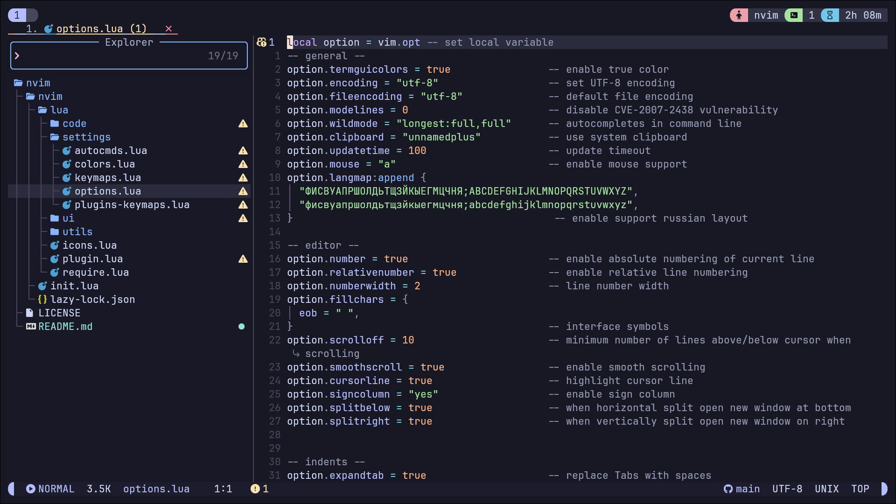

# Sakuyma's Neovim Configuration

Welcome to my Neovim setup!

## 🛠️ Mappings
| Key | Description | Mode |
|-----|-------------|------|
| `<leader>w` | Save file | Normal |
| `x` | Delete without coping to clipboard  | Normal  |
| `jj` | Fast go into normal mode | Insert |
| `<leader>fc` | Format your code | Normal |
| `<leader>n` | Explorer  | Normal |
| `<leader>ff` | Find files | Normal |
| `<leader>fo` | Find old files | Normal |
| `<leader>ft` | Live grep | Normal |
| `<leader>tt` | Todo | Normal |
| `<leader>gb` | Git branches | Normal |
| `<leader>gc` | Git commits | Normal |
| `<leader>gs` | Git status | Normal |
| `<leader>xx` | Toggle Diasgnostic of ur code | Normal |
| `<leader>xt` | Todo troubles Diasgnostic | Normal |
| `<leader>xb` |  Toggle Diasgnostic of ur code (filtered) | Normal |
| `<leader>lg` | Open lazygit | Normal |
| `<leader>sc` | Open Sidekick menu | Normal |

## 🎨 Visuals
*   **Catpuccin Mocha**: Soothing pastel theme for the high-spirited!
*   **Lualine**: A professional statusline showing active LSP, git branch, and path.
*   **Dashboard**: A clean start screen for quick project access.
*   **Colorizer**: Real-time preview of CSS/Hex colors in your code.

Powered by **Lazy.nvim**
